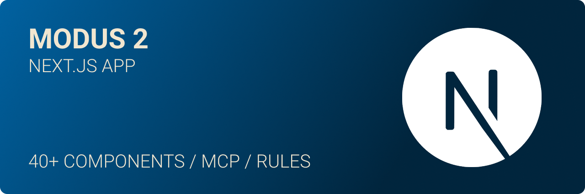
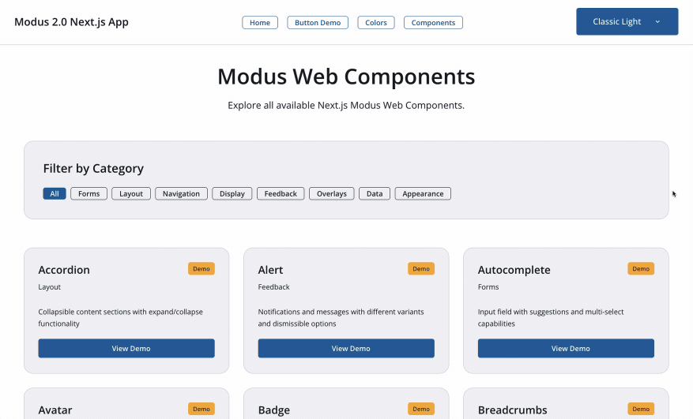
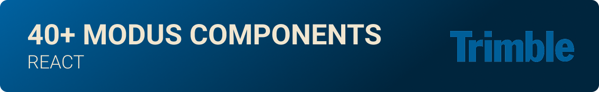

[](https://github.com/julianoczkowski/modus-next-app/actions/workflows/ci.yml)
[](https://nodejs.org/)
[](https://opensource.org/licenses/MIT)

# Modus Next.js Boilerplate

A production-ready Next.js 15 boilerplate/starter template with Modus 2 Web Components integration, featuring React 19, TypeScript support, comprehensive component examples, and modern development practices. Perfect for quickly bootstrapping new applications with the Modus Design System.

## 📋 Built-in Development Rules

This boilerplate comes with comprehensive development rules and standards to ensure code quality and consistency:

### 🎯 Always Applied Rules

- **🎨 Color Usage** - Enforces the 9 approved Modus colors and prevents hardcoded values
- **🧩 Modus Web Components** - Guidelines for proper component implementation with MCP documentation
- **⚡ React Component Creation** - Best practices for React 19 component architecture and CSS patterns

### 🔧 Context-Specific Rules

- **🎭 Modus Icons** - Complete icon system with 500+ validated icon names
- **🌐 Chrome DevTools Testing** - Browser debugging integration via MCP for implementation testing

> **Location:** All rules are stored in `.cursor/rules/` and automatically guide your development workflow through AI assistants.

<!--  -->

## 🤖 AI Development Enhanced

This boilerplate comes pre-configured with powerful AI development tools to supercharge your workflow:

### MCP Servers Included

- **🔧 Context7** - Advanced context management for AI assistants
- **🌐 Chrome DevTools** - Browser debugging integration via MCP
- **📚 Modus Documentation** - Direct access to complete Modus Web Components documentation through AI

### Development Rules & Standards

- **📋 Cursor Rules** - Pre-configured development patterns and best practices
- **🎯 Code Quality** - Automated linting, formatting, and type checking
- **🚀 AI-Optimized Workflow** - Seamless integration with modern AI coding assistants

> **Note:** The `.cursor/` directory contains MCP server configurations and development rules that enhance your AI-assisted development experience. These tools provide instant access to Modus documentation and maintain code quality standards automatically.

### VS Code GitHub Copilot Integration

This boilerplate includes comprehensive GitHub Copilot instructions for VS Code users:

- **📚 Copilot Instructions** - Located in `.github/copilot-instructions.md` with complete development guidelines
- **📖 Detailed Guides** - Nine specialized instruction files in `.github/instructions/` covering:
  - Development workflow and testing procedures
  - Implementation guide standards for major features
  - Border styling patterns (Tailwind v4 workarounds)
  - Color system compliance (9 Modus colors)
  - Icon usage (500+ validated Modus icons)
  - Semantic HTML avoidance (div-first approach)
  - State management for Modus Web Components
  - Tailwind CSS usage patterns
  - Theme system implementation
- **🤖 Auto-Applied** - GitHub Copilot automatically reads these instructions in VS Code to provide context-aware suggestions that follow project standards

> **Location:** All GitHub Copilot instructions are in `.github/copilot-instructions.md` and `.github/instructions/*.instructions.md`

## What's Included

This boilerplate provides a complete foundation for building Next.js applications with Modus Web Components:

- ✅ **Next.js 15 + React 19** - Modern framework with App Router and full type safety
- ✅ **Modus 2 Web Components** - Complete integration with the latest Modus design system
- ✅ **Standard Icon Usage** - Official Modus icon implementation with CDN delivery
- ✅ **Theme Switching** - Support for all Modus themes (Classic/Modern, Light/Dark)
- ✅ **Component Library** - 40+ pre-built Modus components ready to use
- ✅ **Demo Package** - Install `@julianoczkowski/modus-nextjs-demos` for comprehensive examples
- ✅ **Accessibility** - WCAG 2.1 AA compliant with proper ARIA support
- ✅ **Performance Optimized** - Turbopack, code splitting, and optimized builds
- ✅ **Development Tools** - ESLint, TypeScript, and hot module replacement configured
- ✅ **Production Ready** - Optimized build configuration and deployment setup

## 🎨 Figma to Code Integration


If you're working with Figma designs and want AI-assisted coding that understands your design tokens and components, check out the official Modus Figma MCP integration. This powerful tool bridges the gap between design and development by providing direct access to your Figma designs through AI assistants.

**Learn more:** [Modus Figma MCP Integration Guide](https://trimble-oss.github.io/modus-wc-2.0/main/?path=/docs/documentation-modus-figma-mcp-integration-guide--docs)

> **Perfect for:** Design-to-code workflows, maintaining design system consistency, and accelerating development with AI-powered Figma integration.

##


### Prerequisites

- Node.js 20+ (required for Next.js 15 compatibility)
- npm or yarn

### Installation

1. **Clone or use this template:**

   ```bash
   # Clone the repository
   git clone <your-repo-url> my-modus-app
   cd my-modus-app

   # Or use as a template on GitHub
   # Click "Use this template" button
   ```

2. **Install dependencies:**

   ```bash
   npm install
   ```

3. **Start the development server:**

   ```bash
   npm run dev
   ```

4. **Open your browser:**
   Navigate to your localhost usually it is [http://localhost:3000](http://localhost:3000)

### Build for Production

```bash
npm run build
npm start
```

## Project Structure

This boilerplate follows Next.js 15 best practices with a clean, scalable architecture:

```text
modus-next-app/
├── app/
│   ├── components/         # Reusable React components
│   │   ├── ModusButton.tsx # Button wrapper component
│   │   ├── ModusIcon.tsx   # Icon wrapper component
│   │   └── ...             # 40+ Modus components
│   ├── contexts/           # React contexts
│   │   └── ThemeContext.tsx # Theme management
│   ├── globals.css         # Global styles and design system
│   ├── layout.tsx          # Root layout component
│   └── page.tsx            # Homepage
├── public/                 # Public assets
├── scripts/                # Build and utility scripts
├── types/                  # TypeScript definitions
│   └── modus.d.ts          # Modus component types
└── .gitignore             # Git ignore configuration
```

> **💡 Demo Pages:** For comprehensive component examples and interactive demos, install the `@julianoczkowski/modus-nextjs-demos` package. See the [Demo Package](#demo-pages--examples) section for details.

## Using This Boilerplate

### Customizing for Your Project

1. **Update project information:**

   - Modify `package.json` with your project details
   - Update the app title in `app/layout.tsx`
   - Replace demo content in `app/page.tsx` with your application content

2. **Add your components:**

   - Create new components in `app/components/`
   - Add new pages in `app/[feature]/page.tsx`
   - Use Next.js App Router for routing

3. **Configure your build:**
   - Modify `next.config.ts` for your deployment needs
   - Update environment variables as needed
   - Configure additional build optimizations

### Demo Package



To access comprehensive demo pages showcasing all Modus Web Components in action, install the official demo package:

```bash
npm install @julianoczkowski/modus-nextjs-demos
```

This package provides:

- **Interactive Component Demos** - Live examples of all 40+ Modus components
- **Theme Showcases** - See components across all 6 supported themes

### Available Modus Components



This boilerplate includes 40+ pre-built Modus components ready to use:

#### **Form Components**

- **ModusButton** - All variants, colors, sizes, and shapes
- **ModusTextInput** - Single-line text fields with validation
- **ModusTextarea** - Multi-line text fields with helper messages
- **ModusNumberInput** - Numeric input with currency support
- **ModusSelect** - Single-select dropdown with dynamic options
- **ModusCheckbox** - Multiple selection controls
- **ModusRadio** - Exclusive choice controls
- **ModusSwitch** - Binary toggle controls
- **ModusSlider** - Interactive range inputs
- **ModusDate** - Date input with validation
- **ModusTimeInput** - Time picker with min/max limits
- **ModusRating** - Star, smiley, heart, and thumb ratings
- **ModusAutocomplete** - Input with suggestions and multi-select

#### **Layout Components**

- **ModusCard** - Content containers with headers and actions
- **ModusAccordion** - Collapsible content sections
- **ModusDivider** - Content separators with labels
- **ModusUtilityPanel** - Collapsible side panels
- **ModusToolbar** - Three-slot layout containers
- **ModusSkeleton** - Animated loading placeholders

#### **Navigation Components**

- **ModusNavbar** - Full-width application bars
- **ModusSideNavigation** - Collapsible left navigation
- **ModusBreadcrumbs** - Hierarchical navigation trails
- **ModusTabs** - Tab navigation with icons
- **ModusMenu** - Integrated menu systems
- **ModusDropdownMenu** - Contextual menus
- **ModusPagination** - Page navigation controls
- **ModusStepper** - Multi-step workflow indicators

#### **Display Components**

- **ModusIcon** - Icon system with 500+ validated icons
- **ModusAvatar** - User profile images
- **ModusBadge** - Status indicators and counters
- **ModusChip** - Compact tags and filters
- **ModusTable** - Data tables with sorting and selection
- **ModusProgress** - Linear and radial progress indicators

#### **Feedback Components**

- **ModusAlert** - Success, warning, error, and info messages
- **ModusToast** - Transient notifications
- **ModusTooltip** - Contextual helper messages
- **ModusLoader** - Visual loading indicators
- **ModusInputFeedback** - Form field feedback
- **ModusInputLabel** - Form control labels

#### **Overlay Components**

- **ModusModal** - Blocking dialog overlays
- **ModusThemeSwitcher** - Theme toggle controls

## Modus Web Components Integration

### Basic Usage

```tsx
import { ModusWcButton } from "@trimble-oss/moduswebcomponents-react";
import ModusIcon from "@/components/ModusIcon";

export default function MyComponent() {
  const handleClick = () => {
    console.log("Button clicked!");
  };

  return (
    <div>
      {/* Direct web component usage */}
      <ModusWcButton color="primary" onButtonClick={handleClick}>
        <i className="modus-icons" style={{ marginRight: "8px" }}>
          save_disk
        </i>
        Save Changes
      </ModusWcButton>

      {/* Using the ModusIcon wrapper */}
      <ModusIcon
        name="settings"
        size="lg"
        decorative={false}
        ariaLabel="Settings"
      />
    </div>
  );
}
```

### Component Usage Examples

This boilerplate includes comprehensive examples of:

- **Buttons** - All variants, colors, sizes, and shapes
- **Icons** - Complete icon system with standard Modus implementation
- **Alerts** - Success, warning, error, and info messages
- **Theme Switching** - Dynamic theme changes

## Icon System

### Standard Modus Icons

Icons are loaded from the Modus CDN and use the standard `<i class="modus-icons">icon_name</i>` pattern:

```typescript
import "@trimble-oss/modus-icons/dist/field-systems/fonts/modus-icons.css";
```

### Usage Examples

```tsx
import ModusIcon from "@/components/ModusIcon";
import type { ModusIconName } from "@/types/modus";

export default function IconExamples() {
  const iconName: ModusIconName = "settings";

  return (
    <div>
      {/* Basic icon usage */}
      <i className="modus-icons">settings</i>

      {/* Icon with styling */}
      <i className="modus-icons icon-lg icon-primary">{iconName}</i>

      {/* Using the ModusIcon wrapper */}
      <ModusIcon
        name="settings"
        size="lg"
        decorative={false}
        ariaLabel="Settings"
      />
    </div>
  );
}
```

### Available Icon Categories

The application now includes the complete list of all official Modus icons with full TypeScript support:

- **Actions**: add, edit_combination, delete, save_disk, download, upload, copy_content, refresh, sync
- **Navigation**: arrow_left, arrow_right, arrow_up, arrow_down, chevron_left, chevron_right, home, dashboard, menu, close
- **Interface**: search, filter, settings, launch, more_horizontal, more_vertical, sort, view_grid, view_list
- **Status**: check, check_circle, warning, info, alert, help, cancel_circle
- **Content**: file, folder_open, folder_closed, document, image, video, camera
- **User**: person, people_group, user_account, sign_in, sign_out, lock, lock_open
- **Communication**: email, phone, chat, comment, notifications
- **UI**: palette, brightness, visibility_on, visibility_off, toggle_on, toggle_off

**Total Icons Available**: 500+ official Modus icons with complete TypeScript definitions

## Theme System

### Available Themes

This boilerplate supports **6 themes** total:

#### Standard Modus Themes (4 themes)

- `modus-classic-light` (default)
- `modus-classic-dark`
- `modus-modern-light`
- `modus-modern-dark`

#### Trimble Connect Themes (2 themes)

- `connect-light` - For Trimble Connect Web Applications
- `connect-dark` - For Trimble Connect Web Applications

> **Note:** Connect themes should only be used when building Trimble Connect Web Applications. For general applications, use the standard Modus themes.

### Theme Switching

```typescript
// Programmatic theme switching
const changeTheme = (theme: string) => {
  document.documentElement.setAttribute("data-theme", theme);
  localStorage.setItem("modus-theme", theme);
};
```

## TypeScript Support

Full TypeScript support with:

- **Component Props** - Type-safe Modus component properties
- **Event Handlers** - Proper CustomEvent typing
- **Icon Names** - Validated icon name types
- **Theme Values** - Type-safe theme switching

```typescript
// Type definitions for Modus components
import { ModusWcButton } from "@trimble-oss/moduswebcomponents-react";

interface ModusButtonProps {
  color?: "primary" | "secondary" | "tertiary" | "warning" | "danger";
  variant?: "filled" | "outlined" | "borderless";
  size?: "xs" | "sm" | "md" | "lg";
  shape?: "rectangle" | "square" | "circle";
  disabled?: boolean;
  fullWidth?: boolean;
  onButtonClick?: () => void;
  children: React.ReactNode;
}

// Usage with full type safety
export default function MyComponent() {
  const handleClick = () => {
    console.log("Button clicked!");
  };

  return (
    <ModusWcButton color="primary" variant="filled" onButtonClick={handleClick}>
      Click me
    </ModusWcButton>
  );
}
```

## Performance Features

### Code Splitting

- **Route-based splitting** - Each page loads independently
- **Component chunking** - Modus components are bundled separately
- **Vendor separation** - React and utilities in separate chunks

### Icon Optimization

- **Critical icon preloading** - Essential icons load immediately
- **Lazy loading** - Non-critical icons load on demand
- **Font display optimization** - `font-display: swap` for better performance

### Build Optimization

- **Turbopack** - Next.js 15's ultra-fast bundler
- **Tree shaking** - Unused code is eliminated
- **Asset optimization** - Images and fonts are optimized
- **Source maps** - Available for debugging

## Browser Support

- **Modern browsers** - Chrome 90+, Firefox 88+, Safari 14+, Edge 90+
- **Mobile support** - iOS Safari 14+, Chrome Mobile 90+
- **Accessibility** - Screen readers and assistive technologies
- **High contrast** - Windows high contrast mode support

## Development Scripts

```bash
# Development server with Turbopack
npm run dev

# Type checking
npm run type-check

# Production build with Turbopack
npm run build

# Start production server
npm start

# Check for non-Modus color usage
npm run lint:colors
```

## Code Quality & Linting

### Modus Color Enforcement

This boilerplate includes a pre-commit hook that automatically checks for non-Modus color usage:

- **Detects Tailwind colors** - Flags usage of `red-400`, `blue-500`, etc.
- **Detects hardcoded colors** - Catches hex codes like `#ff0000`, RGB values, and Modus hex values
- **Suggests Modus alternatives** - Provides proper Modus CSS custom properties
- **Runs on commit** - Automatically validates staged files before commit

**Example violations caught:**

```css
/* ❌ Will be flagged */
.button {
  background-color: red-500; /* Tailwind color */
  color: #f1f1f6; /* Hardcoded Modus hex */
}
.text {
  color: rgb(23, 28, 30); /* RGB equivalent of Modus color */
}

/* ✅ Correct Modus usage */
.button {
  background-color: var(--modus-wc-color-error);
  color: var(--modus-wc-color-base-100);
}
.text {
  color: var(--modus-wc-color-base-content);
}
```

**Available Modus Color Variables (9 colors total):**

**Base Colors (5 total):**

- `var(--modus-wc-color-base-page)` - Background: #fff (light) / #000 (dark)
- `var(--modus-wc-color-base-100)` - Light gray: #f1f1f6 (light) / #252a2e (dark)
- `var(--modus-wc-color-base-200)` - Medium gray: #cbcdd6 (light) / #464b52 (dark)
- `var(--modus-wc-color-base-300)` - Dark gray: #b7b9c3 (light) / #353a40 (dark)
- `var(--modus-wc-color-base-content)` - Text: #171c1e (light) / #cbcdd6 (dark)

**Semantic Colors (4 total - same in both themes):**

- `var(--modus-wc-color-info)` - Blue: #0063a3
- `var(--modus-wc-color-success)` - Green: #1e8a44
- `var(--modus-wc-color-error)` - Red: #da212c
- `var(--modus-wc-color-warning)` - Orange: #fbad26

> **Note:** Component props like `primary`, `secondary`, `tertiary`, and `danger` map to these CSS variables internally.

## Deployment

This boilerplate is ready for deployment to various platforms:

### Static Hosting (Netlify, Vercel, GitHub Pages)

```bash
npm run build
# Deploy the dist/ folder
```

## Customization

### Adding New Components

1. **Install additional Modus components** if needed
2. **Add TypeScript definitions** in `src/types/modus.d.ts`
3. **Create wrapper components** in `src/components/`
4. **Add examples** in the demo pages or remove demo content for production

### Custom Styling

Use Modus CSS custom properties for consistent theming:

```css
.custom-component {
  background-color: var(--modus-wc-color-base-100);
  color: var(--modus-wc-color-base-content);
  border: 1px solid var(--modus-wc-color-base-200);
}

/* Status-specific styling */
.success-message {
  color: var(--modus-wc-color-success);
  border-left: 3px solid var(--modus-wc-color-success);
}

.error-message {
  color: var(--modus-wc-color-error);
  border-left: 3px solid var(--modus-wc-color-error);
}
```

### Tailwind CSS Integration

This boilerplate includes Tailwind CSS 4 with design system integration:

```tsx
// Use Tailwind classes with design system colors
<div className="bg-card border-default rounded-lg p-6">
  <h2 className="text-2xl font-semibold text-foreground">Title</h2>
  <p className="text-muted-foreground">Description</p>
</div>
```

## Troubleshooting

### Icons Not Displaying

1. **Check font loading** - Ensure Modus icons CSS is imported
2. **Verify icon names** - Use only valid Modus icon names
3. **Check network** - CDN may be blocked in some environments

### Components Not Rendering

1. **Verify imports** - Ensure Modus components are imported
2. **Check custom elements** - Next.js should recognize `modus-wc-*` tags
3. **Browser support** - Ensure browser supports web components

### Theme Issues

1. **HTML attribute** - Ensure `data-theme` is set on `<html>`
2. **CSS loading order** - Modus styles should load before custom styles
3. **Local storage** - Theme preference should persist across sessions

## Contributing

When contributing to this boilerplate:

1. **Follow React 19 best practices**
2. **Maintain TypeScript strict mode**
3. **Use Modus design tokens**
4. **Test across all themes**
5. **Ensure accessibility compliance**
6. **Update documentation as needed**

## Support & Resources

- [Modus Web Components Documentation](https://trimble-oss.github.io/modus-wc-2.0/main/)
- [Next.js Documentation](https://nextjs.org/docs)
- [React 19 Documentation](https://react.dev/)
- [TypeScript Documentation](https://www.typescriptlang.org/)
- [Tailwind CSS Documentation](https://tailwindcss.com/docs)

## License

MIT License - see LICENSE file for details.

---

## Ready to Build! 🚀

**Ready to build amazing applications with Modus Design System and Next.js 15!**

This boilerplate provides everything you need to get started quickly while following best practices and maintaining high code quality.

---

## Creator

### Made with ❤️ by [Julian Oczkowski](https://github.com/julianoczkowski)

Lead Product Designer bridging UX & Code • Building AI-driven tools, design systems, and digital products

🎥 [YouTube](https://www.youtube.com/@julianoczkowski) • 💼 [LinkedIn](https://linkedin.com/in/julianoczkowski) • 🌐 [Website](https://www.julianoczkowski.com)

Created for the Trimble community and developers worldwide 🌍
